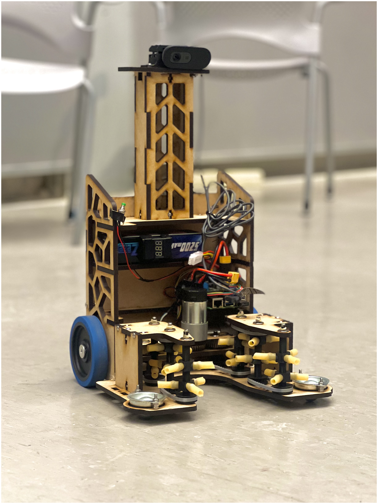

## OVERVIEW

I competed in the MIT MASLAB robot competition over winter break in 2025/2026.

Each year, participants have one month to design, build, and program a robot to compete in a game; in our year, the goal was to pick up Pringles cans and place them in their appropriate (color-coded) goals, while competing with another robot for the same cans under a time limit. 

The idea was for the robot to work completely autonomously, with no user input, for the 3 minute length of a round.

 

## THE ROBOT

Below is a picture of the final robot design, which won 2nd place in the competition.
It featured an intake and outtake mechanism using surgical tubing for grip, that could store up to two cans at once. 

_Our final robot design_

 

## MY WORK

Due to the varying skill sets in our team, I ended up writing all of the software for the robot.

The final system allowed for object-permanence, allowing the robot to map its environment and remember where certain objects were even if they weren't in its field of view. This was achieved using odometry to integrate the motion of the wheels and approximate the absolute position of the robot in space, combined with homography using the camera to estimate the relative positions of objects from the robot. Combined, it was possible to make surprisingly accurate estimates of the positions of real-world objects. 

The code is avilable in the GitHub repository: https://github.com/uridarom/MASLAB-2026