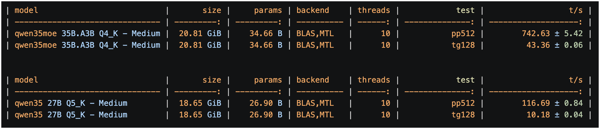
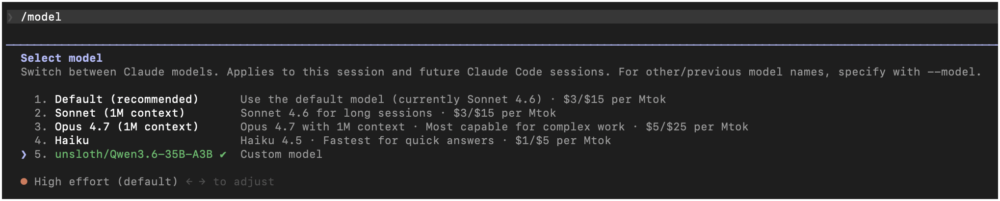
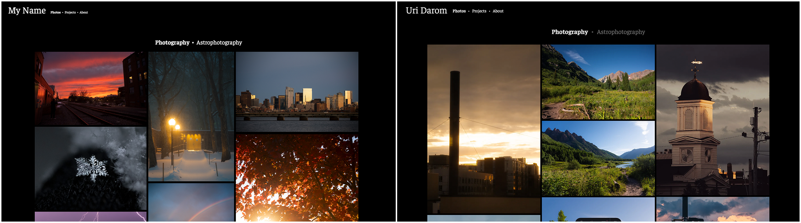

## OVERVIEW

I have recently (as of the time of writing) started playing around with using locally-run LLMs for coding tasks. I figured if they were good _enough_, then it would make sense economically to use them, at least for less complex tasks. 
This also happened to be my introduction to formal LLM-assisted coding ('vibe coding') using proper development tools (I use claude-code). More on that later.

I ran all models using llama.cpp. My model of choice so far has been the Qwen3.6 35B-A3B model. This is a Mixture of Experts model developed by Alibaba Cloud, specifically (from what I can gather) for the purpose of coding on weaker hardware. It is quite quick; on my Macbook M4 Pro with 48GB memory, it can consistently output 40 tokens/second. 

The Alibaba team also developed a dense version of the Qwen3.6 model, known as Qwen3.6 27B. People have reported better results using this model compared to the MoE version for more complex tasks, at the cost of performance. Unfortunately, my hardware was not up to this task; the memory bandwidth meant that even the theoretical limit for this model would be somewhere around 15 tokens/second. Anecdotally, I was getting a very poor 6 tokens/second with this model. Some performance tradeoff for higher 'intelligence' makes sense, but this was too slow to get anything done in a reasonable time span.

_A standardized 512 tokens in, 128 tokens out benchmark for the two Qwen3.6 models.  35B-A3B, at ~43 tk/s, was about 4 times faster than 27B at ~10 tk/s_

Admittedly, I did not use the smallest quantization for the dense model as I did with the MoE model (Q5 vs Q4). However, the difference is small and I do not anticipate that performance will be significantly improved with Q4.

 

## THE CHALLENGE

I spent a few days testing out the capabilities of the model in different tasks. Understandably, it seemed to perform significantly better with more popular languages and frameworks. Even with a detailed spec sheet, Qwen3.6 struggled to build a very simple canvas-drawing app in Swift without constant bugs. But given a task in Python or JavaScript, the model seems to do an impressive job given its size in bug solving and feature building. 

Using it with the claude-code CLI was a great experience; the model had no problem with tool use or reasoning. I was worried that using a non-Anthropic model with claude-code would lead to compatibility issues; but aside from being somewhat context-limited (a hardware issue, not a software one) at 128k tokens, the process was extremely smooth.

I figured a good test for this model would be a small project, not a one-file-er but not an enormous project either. I settled on building a simple static gallery website for hosting my photos and projects. This was something that I have been meaning to do for a while; I could never find the time to build the project myself, but 'vibe coding' has gotten to the point where I no longer need to. 

After some investigation, I settled on using Astro for generating the static HTML/CSS website. I liked the photo-optimization features it included and it seemed capable enough that I could expand the website to be more complex in the future, if I wished.

_Qwen3.6 had no problem being integrated with Claude Code_

 

## THE WEBSITE PIPELINE

Directly telling Qwen3.6 to build an Astro gallery website would surely have resulted in catastrophe. The models greatly benefit from strong guidance throughout the building process. Indeed, with some trial and error, I came up with a solution I've found generalizes pretty well to creating small projects with these locally run models.

1. First, I designed what I wanted the website to look like in Google Drawings. Not a professional tool by any means, but it didn't need to be; all I needed was a general representation of what the website should look like. I designed the home page, about page, photo gallery, project gallery, individual project page, and individual photo page.

2. I then fed these images to the Gemini 3 Fast model, with instructions to generate a detailed description of the different page elements in the photo. It provided information on font size, image size and dimensions, locations, general colors / themes, etc. I had it do this for each page. It should be noted that I likely could have done this with Qwen3.6's multimodal capabilities; I simply did not want to wait that long.

3. Using these detailed text descriptions, I prompted Claude Sonnet 4.6 (the smartest model I have access to without paying) to generate a detailed spec sheet for generating the website described by Gemini using Astro. Specifically, I told it to create a step-based implementation guide to creating the website. The idea is to take the more intellectually demanding, higher-level organizational thinking and offload it to a smarter model than the one that would end up doing the implementation.

4. I then created the base directory and prompted Qwen3.6 (via the claude-code CLI) to implement the website by following the spec sheet. One thing that I think helped was having it generate the website one step at a time; it would read the spec sheet, implement the next step, and then stop. I would then manually test its results to check if they behaved as expected, and told it to fix any bugs. After the step was properly implemented, it would move on to the next step. This was repeated until the website was fully implemented.

5. The results straight out of the model ended up being surprisingly similar to the designs I created in Google Drawings. I then manually added some small features and style changes; anything that I think would have been more effort to prompt the model than implement myself. 

_On the left: the Google Drawings concept sketch; on the right, the final website_

This process ended up making the website creation process extremely smooth. I had very little struggle with the model, and the result was essentially exactly what I had been looking for. In fact, the entire process from the idea to a working website took only ~3 hours. 

 

## DEEP PHILOSOPHICAL IMPLICATIONS

I don't think the results of this little experiment were very deep. I was impressed by the capability that a tiny model like Qwen3.6 35B-A3B had when properly prompted. And I do think there is an analog in the interaction between the "smarter" and "dumber" models, and the "ideal" interaction between human and AI in coding. 

From Claude Sonnet's perspective, the task of actually writing the individual lines of code and creating the individual websites was abstracted away by the local model. All Sonnet had to do was think about the large scale organizational details, and the smaller model did the rest. And from my perspective, even the organizational aspects were abstracted away; all I had to worry about was what the final result should look like and the highest-possible-level implementation details (the decision to use Astro as the website generator).

As the frontier models become more competent, this level of abstraction will be taken from small projects like these onto larger, more complex tasks. This kind of progression follows fairly naturally from the forms of abstraction that brought humans to this point. No one needs to worry about writing machine code anymore to execute their programs; and yet people don't argue that the graduation from Assembly to modern languages like Python represents an 'over-reliance' on modern, abstracted programming languages. My (admittedly very optimistic) outlook is that one day, humans will not need to write individual lines of code at all; the challenge of writing new software will have elevated to focusing on large-scale systems design and what the final product should look like. People who don't need to worry about writing code can be more efficient in terms of the scale and the scope of what actually gets made. Hopefully, as software and hardware progresses, the electrical and cooling cost of using LLMs for coding will decrease, allowing humans to ultimately become a more productive species.

 

## THE CODE

The code for this website can be found in its GitHub Repository: https://github.com/uridarom/uridarom.com 