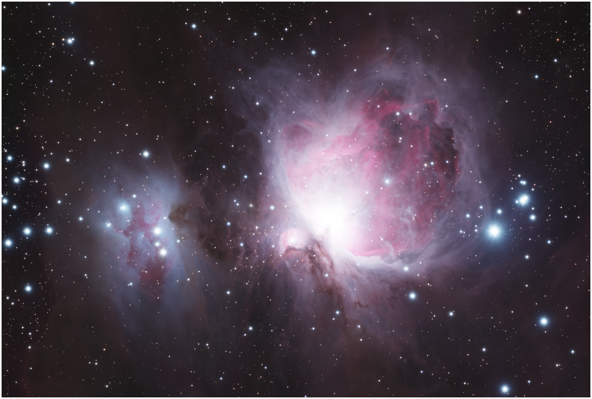
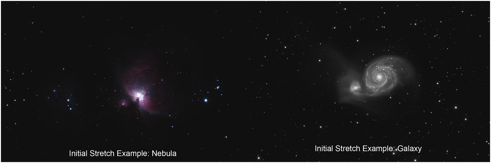
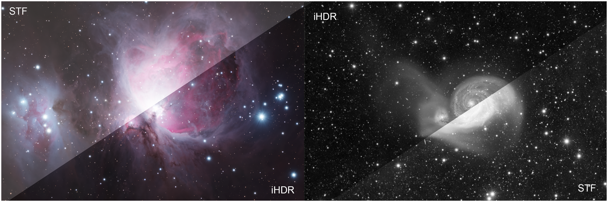

## INTRODUCTION

One of the most difficult targets to process in astrophotography are ones with extremely large differences in brightness. These can include galaxies with very faint halos, or nebulae with very bright cores, such as the Orion Nebula; in all of these examples, the target includes both a very bright inner “core” area, and a faint outer “halo” area. The challenge is to display both of these components in the final image such that neither is too dark nor too bright, while still maintaining a natural looking result.

_An example of a high-dynamic-range target (Messier 42)_

I created iHDR (iterative High Dynamic Range) in an attempt to solve this issue. The program uses multiscale image masks across multiple iterations in order to protect the bright areas of the image from being over-stretched, while still revealing the faint structure that would otherwise be lost in a standard stretch.
 
## INSTALLATION

The iHDR script is available for installation in PixInsight. To install the script in PixInsight, follow the instructions below:

1. In PixInsight, go to Resources–> Updates –> Manage Repositories
2. Click the “Add” button on the bottom left of the popup
3. Enter the repository https://uridarom.com/pixinsight/scripts/iHDR/ and click “OK”
4. Close the window and click on Resources –> Updates –> Check For Updates
5. Click “Apply” on the bottom right of the popup and restart PixInsight
6. The script should appear under Scripts –> Sketchpad –> iHDR

 

## THE SETTINGS

Opening the script reveals the GUI with the settings below. Below is a basic explanation of what each setting does:

  

  
  * **Target View** is the image you want to stretch. The default value is automatically set to the image that was most recently interacted with.
  
  * **Preset** determines the pre-programmed settings you want to use. The options are Low HDR, Medium HDR, and High HDR. As the names suggest, Low HDR will protect the bright areas of the image the least, with the inverse being true for High HDR. Medium HDR will work well for almost all scenarios.
  
  * **Repetitions** is the amount of times the script will run through its entirety on the image. Values above 1 for this option are only relevant for targets with extremely high dynamic range, such as galaxies with very faint halos.
  
  * **Stretch Iterations** determines the amount of times the script will generate a new mask and use it to stretch the image. Higher values will stretch the image more and reduce the strength of the brightness compression, while also increasing the runtime of the script.

  

  

  
  * **Stretch Intensity** determines the strength of the stretch that is applied to the image with each iteration. Higher values will lead to a brighter image.
  
  * **Mask Strength** determines how much the bright areas of the image will be protected in each stretch. Higher values will lead to greater HDR compression, bringing the brightness of the bright and faint parts of the image closer together. Higher values also naturally reduce overall image contrast, so a compromise must be made between HDR strength and image contrast.
  
  * **Layer Preservation** determines the smallest features in the image that will be protected during stretching. Smaller values will better protect small, bright features, at the cost of overall contrast.

  

  The default settings were carefully chosen to provide the best results for the greatest number of scenarios. It is highly recommended to try the default settings with the Medium preset before attempting to make any changes.

 

## USING THE SCRIPT

To use the script, you must first apply a preliminary stretch to the image. This should be a small stretch; the goal is to get the brightest parts of the image to be as bright as you want them at the end of the stretch. Below are two examples of an appropriate preliminary stretch, one for a nebula target and another for a galaxy target.

_Pre-iHDR stretching examples_

After performing an initial stretch, you may execute iHDR on the image after choosing the appropriate settings. After the script finishes running, assess whether the HDR is enough for your needs or if you need to execute the script again.

Below are the same two images after two executions of iHDR at default settings, versus a default STF autostretch:

_Post-iHDR results_

As demonstrated above, iHDR was able to protect the bright areas of these targets while revealing the faint surrounding structure at the same time, which is the goal of the program.

You can now continue to process your data!

